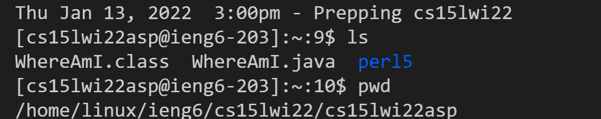

Lab Report 1 - Week 2
=====================
1: Installing VScode
-----------------
> 
- Go to  [Visual Studio Code's website ](https://code.visualstudio.com)
- Follow instructions to download and install to your computer

2: Remotely Connecting
-------------------
> 

- First, [Install OpenSSH](https://docs.microsoft.com/en-us/windows-server/administration/openssh/openssh_install_firstuse)

- Then, using your own CSE15L account and Visual Studio, use the ssh command in the terminal 
    - Example: `ssh cs15lwi22XXX@ieng6.ucsd.edu`
- Say yes to connect and then type your password (nothing will show up because password is hidden)
    - Note: You can logout anytime with __Ctrl + D__ or running the command __exit__


3: Trying Some Commands
--------------------
> 
- You can try some basic commands
    - cd __specifiedDirectory__ - Take you to the specified directory
    - cd .. - Takes you to the parent directory
    - ls - List the files in the current directory 
    - pwd - Prints out the pathname of the current directory
    - mkdir __specifiedName__- makes a new subdirectory with the specified name in the current directory 
    - cp __file1 file2__ - copies contents of file1 to file2

4: Moving Files with scp
---------------------
> 
> 
 - Logout of if you are still logged in
 - Create a java file on your computer called WhereAmI.java with the following content: 
```
class WhereAmI {
  public static void main(String[] args) {
    System.out.println(System.getProperty("os.name"));
    System.out.println(System.getProperty("user.name"));
    System.out.println(System.getProperty("user.home"));
    System.out.println(System.getProperty("user.dir"));
  }
}
```
- Run `scp WhereAmI.java cs15lwi22zz@ieng6.ucsd.edu:~/ ` from terminal while in the directory you made the file
- It should ask for a password, type it in then your file should be sucessfully transfered


5: Setting an SSH Key
------------------

6: Optimizing Remote Running
-------------------------