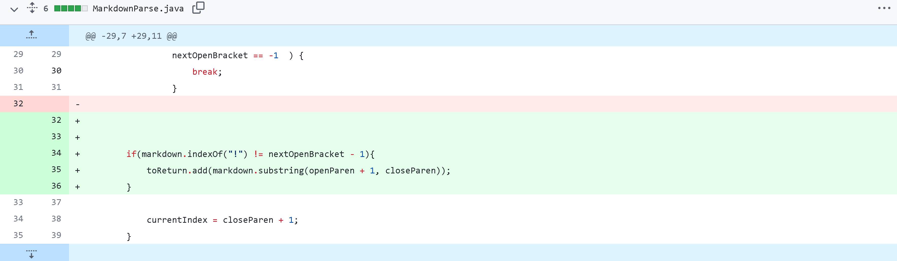
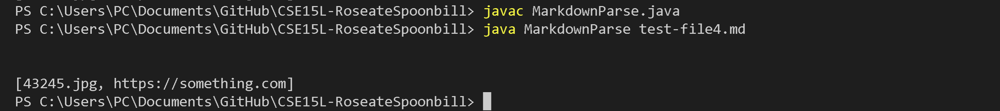
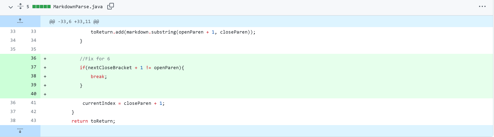
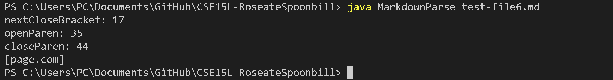
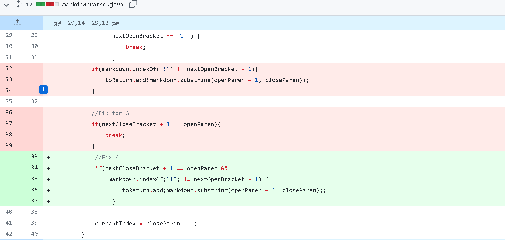
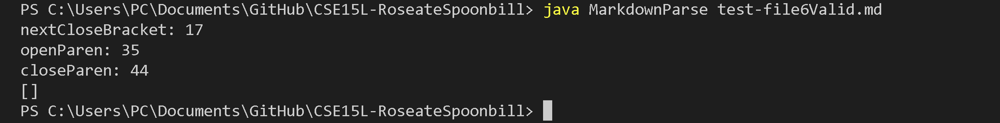

Lab Report 2 - Week 4
=====================

Bug 1
-----------------
Code Change: 
> 

Reason For Change: [Test File 6](https://github.com/immanuel-tran/CSE15L-RoseateSpoonbill/blob/main/test-file4.md)

Symptom:
>  

Explaination:
- The bug in the program was that the code was not able to differentiate between an image and a link.
- Consequently, a symptom of the code is that it will return the image file's name in the ArrayList meant for links. In test file 4, just the link, or [https://something.com], should be returned. However, we get [43245.jpg, https://something.com]
- Our fix for this was to detect if there is a "!" character in front of "[", which signifies that it is a image and not a link.

Bug 2
-------------------
Code Change: 
>  
- Note: My fix was placed incorrectly in the picture above. It should be above the `if(markdown.indexOf("!") != nextOpenBracket - 1)` statement, but I forgot to take a snapshot when I moved it.

Reason For Change: [Test File 6](https://github.com/immanuel-tran/CSE15L-RoseateSpoonbill/blob/main/test-file6.md)

Symptom:
>  

Explaination:
- The bug was that the code looked for parenthesis after any brackets and considered the contents of it it a valid link. It did not matter if there were content in between the brackets and the paranthesis.
- As a result, test file 6 was a failure-inducing input
- The symptom of this bug was that page.com was considered a valid link when it should not have been. The return should have been an empty ArrayList. In test file 6, [] should have been returned instead of [page.com].
- We fixed the problem, by making sure to check that the character after "]" is "(" in order to be considered a valid link. If not, it would break and return an empty ArrayList.

Bug 3
--------------------
Code Change: 
>  

Reason For Change: [Test File 6 w/ Valid Link](https://github.com/immanuel-tran/CSE15L-RoseateSpoonbill/blob/main/test-file6Valid.md)

Symptom:
>  

Explaination:
- Although we fixed the issue with invalid links, we still had another bug.
- If the code detected and invalid link, it would run into a `break;` statement.
- As a result, a symptom of this bug was that if there was a valid link after an invalid one the code would be unable to detect it.
- In the modified version of test file 6 with a valid link, the symptom was that the code would still return an empty ArrayList instead of the valid link. [https://something.com] should have been returned.
- Our solution was that, instead of breaking after a "(' was not detected after a "]", we would try doing the opposite and check if the there was a paranthesis after the bracket. This would allow us to add a valid link even after an invalid one.