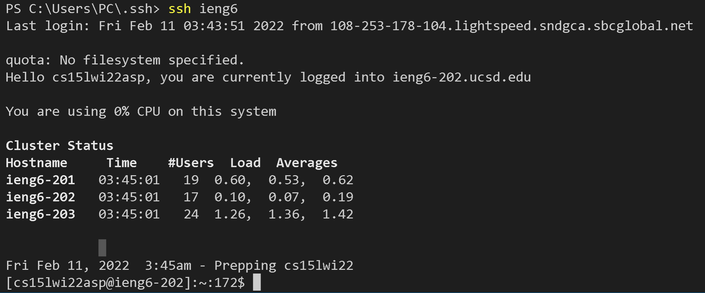

Lab Report 3 - Week 6
=====================

Streamlining ssh Configuration
-----------------
- Previously, we managed to shorten our login process by bypassing the password with an ssh key; however, this process can still be improved.

- Usually we would have to type out a whole account name, which can be prone to error and takes more time.
    - Example: `ssh cs15lwi22zzz@ieng6.ucsd.edu`

- First, navigate to your .ssh directory to be able to create/edit a config file.
    > 

- Using the command `vim config` will allow you to edit the file.

    > 

- To edit press "I" and insert the follow:
```
Host  ieng6 (alias)
    HostName ieng6.ucsd.edu
    User cs15lwi22zzz (username)
```
- Enter you own username and you can choose an alias you want to login with. In my case, I stuck with ieng6.

- Additonally, if it does not work, you can add the follow to explicitly refer to a id_rsa file.

```
Host ieng6
    HostName ieng6.ucsd.edu
    User cs15lwi22zzz (username)
    IdentityFile ~/.ssh/id_rsa
```

- After you are finished editing press "esc" than type ":wq" and enter finish writing and quit.
- Now you should be able to `ssh` with just your alias.
    > 

- In additon to being able to `ssh` quicker, you are also able to copy files to the remote sever with just your alias.
    - Example: I made a test file called test.java. I was able to copy it form my personal computer to the remote sever with the command `scp test.java ieng6:~/`

        > 
- With that, your `ssh` is streamlined even more than before.