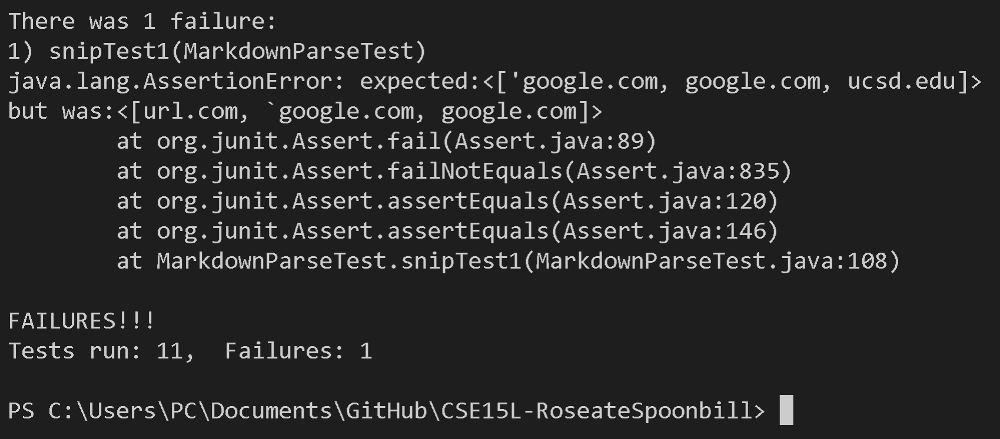
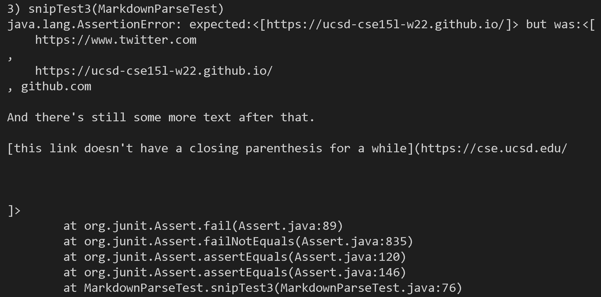

Lab Report 4 - Week 8
=====================

Links: 
-----------------
- [My Markdown-parse Repository](https://github.com/immanuel-tran/CSE15L-RoseateSpoonbill)

- [Reviewed Markdown-parse Repository](https://github.com/Shree-G/markdown-parse)

Snippet 1
-----------------
```
`[a link`](url.com)

[another link](`google.com)`

[`cod[e`](google.com)

[`code]`](ucsd.edu)
```
Expected Output:
> 

My Group:

- Code to Test Snippet 1: 

    ```
    @Test
    public void snipTest1() throws IOException {
        Path fileName = Path.of("snip1.md");
        String contents = Files.readString(fileName);
        ArrayList<String> links = MarkdownParse.getLinks(contents);
        ArrayList<String> expected = new ArrayList<>();
        expected.add("'google.com");
        expected.add("google.com");
        expected.add("ucsd.edu");
        assertEquals(expected, links);
    }
    ```
    - Our test does not pass and below is the resulting JUnit output that shows the test failure.
        >

Reviewed Group:

- Code to Test Snippet 1: 

    ```
    @Test
    public void snipTest1() throws IOException {
        String contents= Files.readString(Path.of("./snip1.md"));
        List<String> expect = List.of("'google.com", "google.com", "ucsd.edu");
        assertEquals(expect, MarkdownParse.getLinks(contents));
    }
    ```
    - Their test does not pass and below is the resulting JUnit output that shows the test failure.
        >

Fix in Less Than 10 Lines:
- Both our group and the reviewed group had Snippet 1 fail when tested. I believe that this can possibly be fixed by changing how the code handle backticks. Specfically, in this case, it should not count brackets within backticks. Somthing like if statement to check if there is a backtick and move to the ending backtick can work.


Snippet 2
-----------------
```
[a [nested link](a.com)](b.com)

[a nested parenthesized url](a.com(()))

[some escaped \[ brackets \]](example.com)
```
Expected Output:

> 


My group:

- Code to Test Snippet 2:  
    ```
    @Test
    public void snipTest2() throws IOException {
        Path fileName = Path.of("snip2.md");
	    String contents = Files.readString(fileName);
        ArrayList<String> links = MarkdownParse.getLinks(contents);
        ArrayList<String> expected = new ArrayList<>();
        expected.add("a.com");
        expected.add("a.com(())");
        expected.add("example.com");
        assertEquals(expected, links);
    }
    ```
    - Our test does not pass and below is the resulting JUnit output that shows the test failure.
        >

Reviewed Group:
- Code to Test Snippet 2:  
    ```
    @Test
    public void snipTest3() throws IOException {
        String contents= Files.readString(Path.of("./snip3.md"));
        List<String> expect = List.of("https://ucsd-cse15l-w22.github.io/");
        assertEquals(expect, MarkdownParse.getLinks(contents));
    }
    ```
    - Their test does not pass and below is the resulting JUnit output that shows the test failure.
        >

Fix in Less Than 10 Lines:
- Both our group and the reviewed group had Snippet 2 fail when tested. I believe that this can possibly be fixed by changing the code so it understands nested parenthesis. I think something like a loop that checks for nested parenthesis could be possible in under 10 lines.


Snippet 3
-----------------
```
[this title text is really long and takes up more than 
one line

and has some line breaks](
    https://www.twitter.com
)

[this title text is really long and takes up more than 
one line](
    https://ucsd-cse15l-w22.github.io/
)


[this link doesn't have a closing parenthesis](github.com

And there's still some more text after that.

[this link doesn't have a closing parenthesis for a while](https://cse.ucsd.edu/


)

And then there's more text
```
Expected Output:
> 

My group:

- Code to Test Snippet 3:  
    ```
    @Test
    public void snipTest3() throws IOException {
        Path fileName = Path.of("snip3.md");
	    String contents = Files.readString(fileName);
        ArrayList<String> links = MarkdownParse.getLinks(contents);
        ArrayList<String> expected = new ArrayList<>();
        expected.add("https://ucsd-cse15l-w22.github.io/");
        assertEquals(expected, links);
    }
    ```
    - Our test does not pass and below is the resulting JUnit output that shows the test failure.
        >

Reviewed group:

- Code to Test Snippet 3:  
    ```
    @Test
    public void snipTest3() throws IOException {
        Path fileName = Path.of("snip3.md");
	    String contents = Files.readString(fileName);
        ArrayList<String> links = MarkdownParse.getLinks(contents);
        ArrayList<String> expected = new ArrayList<>();
        expected.add("https://ucsd-cse15l-w22.github.io/");
        assertEquals(expected, links);
    }
    ```
    - Their test does not pass and below is the resulting JUnit output that shows the test failure.
        >

Fix in Less Than 10 Lines:
- Both our group and the reviewed group had Snippet 3 fail when tested. I believe that this could possibly have a fix by changing how the code handles empty lines. Something like a if statment, to check if there is empty lines inbetween and make the link invalid, may be possible in under 10 lines of code. 