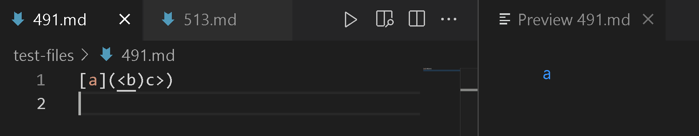
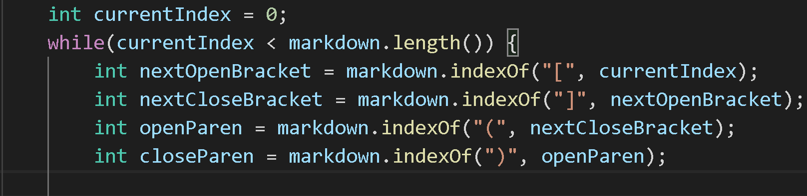
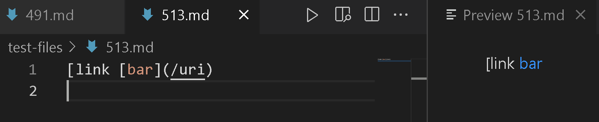
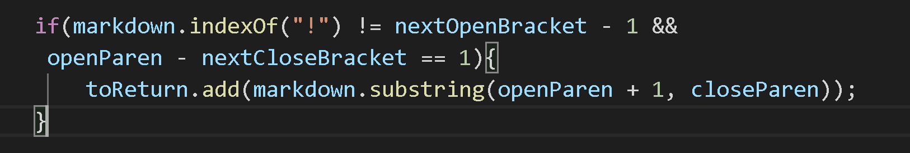

Lab Report 5 - Week 10
=====================

How I find the tests with different results?
-----------------
- First I ran `bash script.sh > results.txt` to store the outputs.
- Then I used `diff CSE15L-RoseateSpoonbill/results.txt markdown-parse/results.txt > different.txt` to store the differences.
- I choose two files: 491.md and 513.md

Test 1: 491.md
--------------
Content: 
```
[a](<b)c>)
```
- Expected Output:
    >
    
    ```
    [<b]
    ```

- Actual Ouput:
    - RoseateSpoonbill:
        ```
        []
        ```
    - markdown-parse:
        ```
        [<b]
        ```
- Issue:        
    > 

    - I believe that our implementation was incorrect because our code did not consider `<b` to be a valid link. The code simply checks for brackets and parentheses. I think a small change that could possibly fix the bug is to check if there is text directly after a closed bracket and a subsequent opened parentheses.

Test 2: 513.md
--------------
Content: 
```
[link [bar](/uri)
```
- Expected Output:
    >

    ```
    [/uri]
    ```
    
- Actual Ouput:
    - RoseateSpoonbill:
        ```
        []
        ```
    - markdown-parse:
        ```
        [/uri]
        ```
- Issue:
    > 

    - I believe that our implementation was erroneous because the code does not find a "!" and the nextOpenBracket is 0. I think a change that could possibly fix this bug is writting if and else statements to check if nextOpenBraket is 0 and making having a "!" not necessary. 